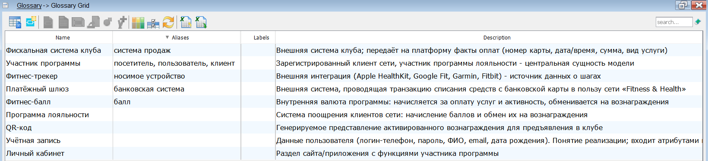
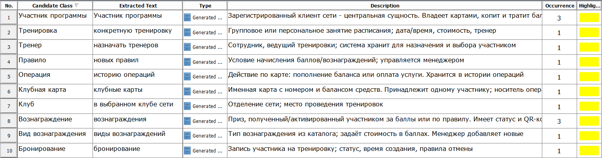
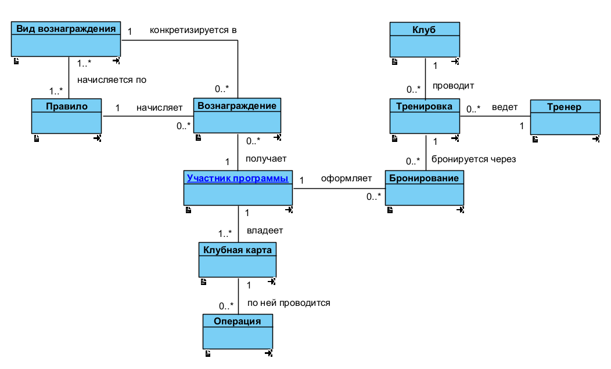
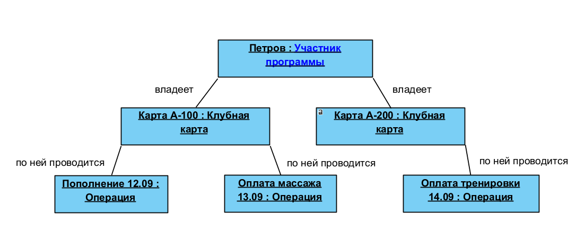
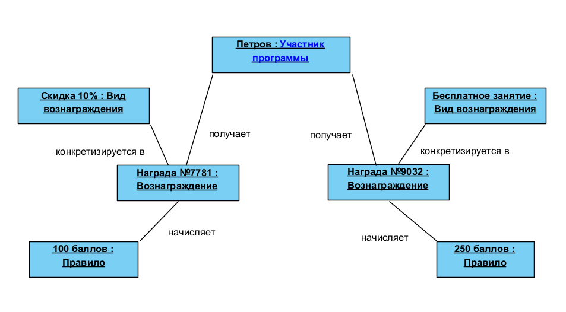
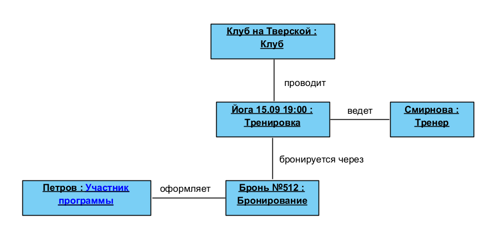

# Лабораторная работа №1. Разработка концептуальной модели классов

| | |
|---|---|
| **Кейс** | Система управления программой лояльности сети фитнес-клубов «Fitness & Health» |
| **Учебник** | Галиаскаров Э.Г., Воробьёв А.С. «Анализ и проектирование систем с использованием UML» |
| **Теория** | Розенберг Д., Скотт К. «Применение объектного моделирования с использованием UML» (ICONIX) |
| **Инструмент** | Visual Paradigm 18.1 |
| **Автор** | Артемий, бизнес-информатика, 3 курс |

> Результат ЛР №1 - концептуальная (доменная) модель классов: только классы, связи и кратности. Атрибутов и методов нет - они появятся на следующих итерациях (ЛР №2–3).

---

## 1. Общие сведения

### 1.1. Цель и задачи работы

**Цель работы:** построить концептуальную модель предметной области фитнес-клуба «Fitness & Health» в виде диаграммы классов с глоссарием - достаточную основу для дальнейшего проектирования информационной системы.

**Задачи работы:**
1. Провести текстуальный анализ описания кейса.
2. Сформировать список классов-кандидатов.
3. Выделить ключевые классы предметной области и описать каждый (словарь данных).
4. Составить глоссарий проекта.
5. Определить ассоциации, дать им отглагольные названия и проставить кратности на обоих концах.
6. Построить диаграмму классов.
7. Проверить корректность кратностей диаграммами объектов.

### 1.2. Назначение и задачи проектируемой системы

**Назначение системы:** автоматизировать управление программой лояльности сети «Fitness & Health» - клубными картами и балансом, начислением и расходованием фитнес-баллов, вознаграждениями, записью на тренировки и взаимодействием с клиентами.

**Задачи системы:**
- вести учётные записи участников и личные кабинеты;
- управлять клубными картами (добавление, блокировка, баланс);
- проводить операции пополнения и оплаты услуг через платёжный шлюз;
- начислять фитнес-баллы по заданным правилам на основе данных из фискальной системы клубов;
- управлять каталогом вознаграждений, правилами начисления и активацией вознаграждений (QR-код);
- вести расписание и бронирование тренировок с учётом баланса карты и штрафов за отмену;
- интегрироваться с фитнес-трекерами (Apple HealthKit, Google Fit, Garmin, Fitbit);
- публиковать контент (статьи, акции) и администрировать платформу (менеджер).

---

## 2. Глоссарий проекта

Глоссарий шире списка классов: в него входят и внешние системы, и понятия, не ставшие классами (определения ключевых классов - в §4).

| Термин | Синонимы | Определение |
|---|---|---|
| **Участник программы** | посетитель, пользователь, клиент | Зарегистрированный клиент сети, участник программы лояльности - центральная сущность модели |
| **Программа лояльности** | - | Система поощрения клиентов сети: начисление баллов и обмен их на вознаграждения |
| **Фитнес-балл** | балл | Внутренняя валюта программы: начисляется за оплату услуг и активность, обменивается на вознаграждения |
| **Учётная запись** | - | Данные пользователя (логин-телефон, пароль, ФИО, email, дата рождения). Понятие реализации; входит атрибутами в «Участник программы» |
| **Личный кабинет** | - | Раздел сайта/приложения с функциями участника программы |
| **QR-код** | - | Генерируемое представление активированного вознаграждения для предъявления в клубе |
| **Платёжный шлюз** | банковская система | Внешняя система, проводящая транзакцию списания средств с банковской карты в пользу сети «Fitness & Health» |
| **Фискальная система клуба** | система продаж | Внешняя система клуба; передаёт на платформу факты оплат (номер карты, дата/время, сумма, вид услуги) |
| **Фитнес-трекер** | носимое устройство | Внешняя интеграция (Apple HealthKit, Google Fit, Garmin, Fitbit) - источник данных о шагах |

---

## 3. Текстуальный анализ: список классов-кандидатов

Правило отбора: класс-кандидат - сущность, **которой пользователь может манипулировать внутри системы**, записанная существительным в единственном числе именительном падеже. Исключаются: понятия уровня реализации (система, сайт, форма, учётная запись), простые значения (атрибуты), отчёты и печатные формы, роли и персонал, внешние системы, избыточные и производные понятия.

### 3.1. Решения по кандидатам

| Кандидат (ед. ч., им. п.) | Решение | Обоснование |
|---|---|---|
| Участник программы | ✅ ключевой | Центральная сущность. Синонимы «посетитель», «пользователь», «клиент» сведены к ней |
| Клубная карта | ✅ ключевой | Идентификатор участника; хранит баланс; по ней идут операции и баллы |
| Операция | ✅ ключевой | Обобщает «пополнение» и «оплату услуги»; хранится история - объектов много |
| Вознаграждение | ✅ ключевой | То, ради чего копятся баллы; активируется и используется |
| Вид вознаграждения | ✅ ключевой | Каталог типов; менеджер добавляет новые |
| Правило | ✅ ключевой | Правила начисления; менеджер создаёт/меняет/отменяет |
| Клуб | ✅ ключевой | Сеть клубов; тренировки проходят в конкретном клубе |
| Тренировка | ✅ ключевой | Занятие в расписании; имеет стоимость и тренера |
| Бронирование | ✅ ключевой | Запись на тренировку; хранится, имеет статус, правила отмены и штраф |
| Тренер | ✅ ключевой | Назначается на тренировку; система хранит для выбора участником |
| Учётная запись | ❌ исключён | Понятие реализации; её данные - атрибуты «Участника». В глоссарии оставлена |
| Фитнес-балл | ❌ исключён | Простое значение (число) → атрибут «количество баллов» |
| Банковская карта | ❌ исключён | Данные конфиденциальны, вводятся в момент операции; система их не хранит |
| Платёжный шлюз / фискальная система / фитнес-трекер | ❌ исключены | Внешние системы. В глоссарий |
| QR-код | ❌ исключён | Генерируемое представление вознаграждения (как печатная форма) |
| Статья | ❌ исключён | Относится к сайту/контенту, а не к программе лояльности |
| Менеджер платформы | ❌ исключён | Персонал/действующее лицо → перейдёт в модель вариантов использования (ЛР №2) |
| Расписание | ❌ исключён | Агрегат-представление набора тренировок, не самостоятельный объект |
| Баланс, сумма, дата, ФИО, email, пароль, номер | ❌ исключены | Простые значения → атрибуты |

---

## 4. Словарь данных (ключевые классы)

| Класс | Назначение |
|---|---|
| **Участник программы** | Зарегистрированный клиент - центральная сущность. Владеет картами, копит/тратит баллы, получает вознаграждения, бронирует тренировки |
| **Клубная карта** | Именная карта с номером и балансом. Принадлежит ровно одному участнику; носитель операций и баллов |
| **Операция** | Действие по карте - пополнение баланса или оплата услуги. Хранится в истории операций |
| **Вознаграждение** | Конкретный приз участника: получен за баллы или по правилу, имеет статус и QR-код |
| **Вид вознаграждения** | Тип вознаграждения из каталога; задаёт стоимость в баллах |
| **Правило** | Условие начисления баллов/вознаграждений, управляемое менеджером |
| **Клуб** | Отделение сети; место проведения тренировок |
| **Тренировка** | Групповое/персональное занятие расписания; дата/время, стоимость, тренер |
| **Бронирование** | Запись участника на тренировку; статус, время создания, правила отмены |
| **Тренер** | Сотрудник, ведущий тренировки |

---

## 5. Ассоциации между классами

Названия - отглагольные фразы; кратности заданы на обоих концах.

| № | Класс A | Кратн. A | Связь | Кратн. B | Класс B |
|---|---|---|---|---|---|
| 1 | Участник программы | 1 | владеет | 1..* | Клубная карта |
| 2 | Клубная карта | 1 | по ней проводится | 0..* | Операция |
| 3 | Участник программы | 1 | получает | 0..* | Вознаграждение |
| 4 | Вид вознаграждения | 1 | конкретизируется в | 0..* | Вознаграждение |
| 5 | Правило | 1 | начисляет | 0..* | Вознаграждение |
| 6 | Вид вознаграждения | 1..* | начисляется по | 1..* | Правило |
| 7 | Клуб | 1 | проводит | 0..* | Тренировка |
| 8 | Тренер | 1 | ведёт | 0..* | Тренировка |
| 9 | Участник программы | 1 | оформляет | 0..* | Бронирование |
| 10 | Тренировка | 1 | бронируется через | 0..* | Бронирование |

**Исключённые избыточные связи:**
- *Участник программы - Операция* - удалена (транзитивна: участник → карта → операция).
- *Участник программы - Тренировка* - удалена (идёт через Бронирование).

---

## 6. Диаграмма классов предметной области

---

## 7. Диаграммы объектов (проверка кратностей)

Диаграмма объектов - снимок системы в конкретный момент: экземпляры классов с реальными значениями, соединённые связями (link) без кратностей. В совокупности три снимка покрывают все 10 классов.

### 7.1. Операции по клубной карте

Участник владеет **двумя** картами (подтверждает `1..*` на «владеет»); по карте A-100 - две операции, по A-200 - одна (подтверждает `0..*` на «по ней проводится»).

### 7.2. Вознаграждения участника

У участника несколько вознаграждений (`0..*`), каждое - одного вида и начислено по одному правилу.

### 7.3. Бронирование тренировки

Бронирование относится к одному участнику и одной тренировке; тренировка проходит в одном клубе и ведётся одним тренером.

---

## 8. Соответствие чек-листу

| Критерий | Где в работе | Статус |
|---|---|---|
| 1.1 Цели/задачи работы | §1.1 | ✅ |
| 1.2 Цели/задачи системы | §1.2 | ✅ |
| 1.3 Глоссарий | §2 | ✅ |
| 2.1 Наличие диаграммы классов | §6 | ✅ |
| 2.2 Имя класса - сущ. ед. ч. им. п. | §3, §4 | ✅ |
| 2.3 Словарь данных, каждый класс описан | §4 | ✅ |
| 2.4 Ассоциации подписаны отглагольной фразой | §5 | ✅ |
| 2.5 Нет классов-сирот | §6 | ✅ |
| 2.6 / 2.12 Кратности и имена на обоих концах | §5 | ✅ |
| 2.10 Нет избыточных связей | §5 | ✅ |
| Диаграммы объектов составлены | §7 | ✅ |
| 2.8 / 2.9 Атрибуты по классам | - | ⏳ следующая итерация |
| 2.7 MDriven Designer / 2.13–2.14 OCL | - | ⏳ ЛР №3 |

---

## 9. Открытые решения (для защиты)

1. **Услуга как класс** - вводить каталог услуг или оставить «вид услуги» атрибутом операции? Зависит от того, ведёт ли система прайс.
2. **Ежедневная активность / шаги** - отдельный класс нужен для моделирования челленджа; иначе вне ядра.
3. **Операция** - один класс или специализация *Пополнение / Оплата услуги*? Решается при распределении атрибутов.
4. **Клуб ↔ Участник** - нужна ли связь «участник закреплён за клубом», или достаточно связи через бронирование?

