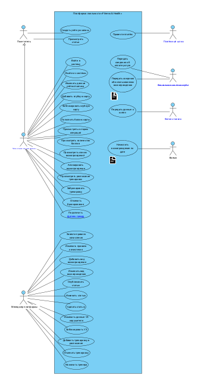
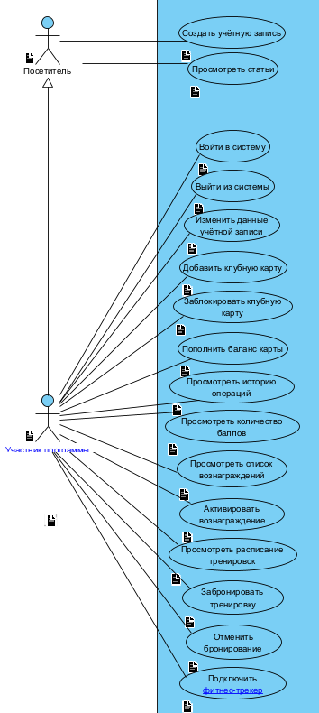
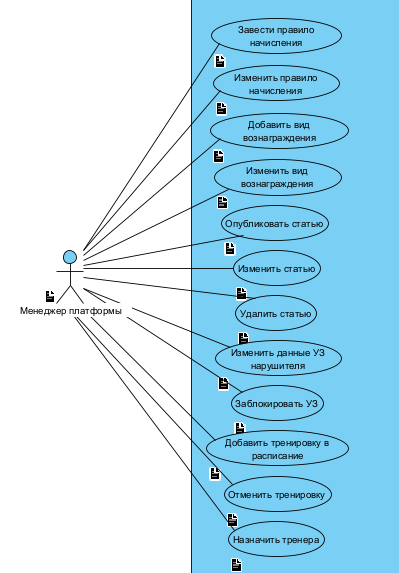
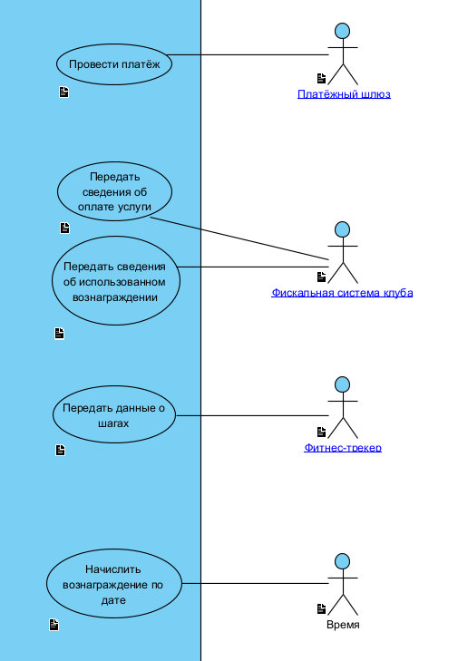

# Лабораторная работа №2. Разработка модели вариантов использования

| | |
|---|---|
| **Кейс** | Система управления программой лояльности сети фитнес-клубов «Fitness & Health» |
| **Учебник** | Галиаскаров Э.Г., Воробьёв А.С. «Анализ и проектирование систем с использованием UML», гл. 2 |
| **Теория** | Розенберг Д., Скотт К. (ICONIX); материалы GetAnalyst (обычные и интеграционные Use Cases) |
| **Инструмент** | Visual Paradigm 18.1 |
| **Автор** | Белянкин Артемий Русланович, БИ 3-3 |

> ЛР2 отвечает на вопрос **«что система делает и для кого»** - функциональные требования и границы системы.

---

## 1. Общие сведения

### 1.1. Цель и задачи работы

**Цель работы:** определить функциональные требования и границы проектируемой системы через модель вариантов использования - выявить действующих лиц, их задачи и связи с системой.

**Задачи работы:**
1. Провести текстуальный анализ кейса (искать акторов и их задачи).
2. Определить список действующих лиц.
3. Определить задачи (варианты использования) каждого актора.
4. Сформулировать наименования вариантов использования (единый стиль).
5. Дать краткое описание каждого варианта использования.
6. Построить диаграмму вариантов использования.

---

## 2. Действующие лица (акторы)

**Актор** - сущность (человек, роль, внешняя система или «время»), которая **взаимодействует с системой ради собственной цели**. Акторы находятся *вне* границ системы.

| Актор | Тип | Описание |
|---|---|---|
| **Посетитель** | первичный | Незарегистрированный гость платформы. Может читать статьи и зарегистрироваться |
| **Участник программы** | первичный | Зарегистрированный клиент сети, участник программы лояльности. Основной пользователь. *Обобщает Посетителя* |
| **Менеджер платформы** | первичный | Администратор: правила начисления, вознаграждения, расписание, контент, учётные записи нарушителей |
| **Платёжный шлюз** | вторичный (внешняя система) | Проводит транзакцию списания средств с банковской карты в пользу сети |
| **Фискальная система клуба** | вторичный (внешняя система) | Передаёт на платформу факты оплат услуг и погашения вознаграждений |
| **Фитнес-трекер** | вторичный (внешняя система) | Передаёт данные о шагах (Apple HealthKit, Google Fit, Garmin, Fitbit) |
| **Время** | вторичный (специальный) | Инициирует события по дате (напр., гостевой пропуск в день рождения) |

**Отношение обобщения:** `Участник программы → Посетитель` - участник умеет всё, что и посетитель, плюс свои функции.

---

## 3. Варианты использования

Правила именования (критерии 3.3–3.6): глагол **совершенного вида** + дополнение; единый стиль; уникальность; отражает цель пользователя. Разделение на **обычные** и **интеграционные** - по методичке GetAnalyst.

### 3.1. Обычные варианты использования

**Посетитель**
| № | Вариант использования | Краткое описание |
|---|---|---|
| 1 | Создать учётную запись | Посетитель регистрируется, указывая телефон (логин), пароль, ФИО, дату рождения, email и номера клубных карт |
| 2 | Просмотреть статьи | Любой посетитель читает статьи о ЗОЖ, услугах и акциях |

**Участник программы**
| № | Вариант использования | Краткое описание |
|---|---|---|
| 3 | Войти в систему | Участник получает доступ к личному кабинету |
| 4 | Выйти из системы | Участник завершает сессию |
| 5 | Изменить данные учётной записи | Участник редактирует сведения о себе |
| 6 | Добавить клубную карту | Участник привязывает к аккаунту новую карту |
| 7 | Заблокировать клубную карту | Участник блокирует потерянную карту |
| 8 | Пополнить баланс карты | Участник пополняет карту с банковской карты (*→ интеграция с платёжным шлюзом*) |
| 9 | Просмотреть историю операций | Участник смотрит пополнения и оплаты по карте |
| 10 | Просмотреть количество баллов | Участник видит накопленные фитнес-баллы |
| 11 | Просмотреть список вознаграждений | Участник смотрит доступные по баллам вознаграждения |
| 12 | Активировать вознаграждение | Участник активирует вознаграждение, получает QR-код, баллы списываются |
| 13 | Просмотреть расписание тренировок | Участник смотрит расписание в выбранном клубе |
| 14 | Забронировать тренировку | Участник бронирует место на тренировку |
| 15 | Отменить бронирование | Участник отменяет бронь (с учётом правила 2 часов и штрафа) |
| 16 | Подключить фитнес-трекер | Участник авторизует доступ к данным об активности |

**Менеджер платформы**
| № | Вариант использования | Краткое описание |
|---|---|---|
| 17 | Завести правило начисления | Менеджер создаёт новое правило начисления баллов/вознаграждений |
| 18 | Изменить правило начисления | Менеджер редактирует существующее правило |
| 19 | Добавить вид вознаграждения | Менеджер заводит новый вид вознаграждения |
| 20 | Изменить вид вознаграждения | Менеджер редактирует условия вознаграждения |
| 21 | Опубликовать статью | Менеджер публикует статью |
| 22 | Изменить статью | Менеджер редактирует статью |
| 23 | Удалить статью | Менеджер удаляет неактуальную статью |
| 24 | Изменить данные УЗ нарушителя | Менеджер правит данные учётной записи нарушителя |
| 25 | Заблокировать УЗ | Менеджер блокирует учётную запись нарушителя |
| 26 | Добавить тренировку в расписание | Менеджер создаёт тренировку, задаёт стоимость |
| 27 | Отменить тренировку | Менеджер отменяет/изменяет тренировку в расписании |
| 28 | Назначить тренера | Менеджер назначает тренера на тренировку |

### 3.2. Интеграционные варианты использования

| № | Вариант использования | Актор | Краткое описание |
|---|---|---|---|
| 29 | Провести платёж | Платёжный шлюз | Внешняя система списывает средства с банковской карты и подтверждает пополнение |
| 30 | Передать сведения об оплате услуги | Фискальная система клуба | Внешняя система передаёт факт оплаты → платформа начисляет баллы |
| 31 | Передать сведения об использованном вознаграждении | Фискальная система клуба | Внешняя система сообщает о погашении QR → платформа помечает вознаграждение использованным |
| 32 | Передать данные о шагах | Фитнес-трекер | Внешняя система передаёт шаги → платформа начисляет баллы за активность / засчитывает челлендж |

### 3.3. Варианты использования по времени

| № | Вариант использования | Актор | Краткое описание |
|---|---|---|---|
| 33 | Начислить вознаграждение по дате | Время | В день рождения участника начисляется «Фирменный гостевой пропуск» |

---

## 4. Диаграмма вариантов использования

Для читаемости (33 варианта) диаграмма разбита на три листа. Границы системы - прямоугольник «Платформа лояльности «Fitness & Health»»; акторы снаружи; связь актор↔вариант - «коммуникация» (простая линия); обобщение `Участник программы ──▷ Посетитель`.

### 4.1. Общий вид

### 4.2. Посетитель и участник программы

Обобщение: Участник наследует функции Посетителя («Создать учётную запись», «Просмотреть статьи»), поэтому они связаны с Посетителем, а не дублируются на Участнике.

### 4.3. Менеджер платформы

### 4.4. Интеграции и время

Внешние системы (платёжный шлюз, фискальная система, фитнес-трекер) и «Время» порождают интеграционные варианты использования - сценарии взаимодействия системы с внешними сервисами.

---

## 5. Соответствие чек-листу (раздел 3)

| Критерий | Где в работе | Статус |
|---|---|---|
| 3.1 Определены действующие лица | §2 | ✅ |
| 3.2 Определены варианты использования | §3 | ✅ |
| 3.3 Название - глагольная фраза | §3 | ✅ |
| 3.4 Единый стиль именования | §3 (везде глагол сов. вида) | ✅ |
| 3.5 Названия уникальны | §3 (дубли устранены, менеджерский UZ переименован) | ✅ |
| 3.6 Название отражает цель | §3 | ✅ |
| 3.7 Краткое описание каждого | §3 | ✅ |
| 3.8 Диаграмма вариантов использования | §4 | ✅ |
| 3.9–3.18 Детальные сценарии | - | ⏳ ЛР №4 |
| 3.20 Привязка к User Story (доп.) | - | ⏳ при необходимости |
