# Лабораторная работа №3. Уточнение концептуальной модели классов

| | |
|---|---|
| **Кейс** | Система управления программой лояльности сети фитнес-клубов «Fitness & Health» |
| **Учебник** | Галиаскаров Э.Г., Воробьёв А.С. «Анализ и проектирование систем с использованием UML», гл. 3 |
| **Инструменты** | Visual Paradigm 18.1 (уточнение модели) + MDriven Designer (OCL-проверка) |
| **Автор** | Белянкин Артемий Русланович, БИ 3-3 |

> ЛР3: классы получают **атрибуты и типы**, появляются **перечисления** и **специализация**, а затем модель **проверяется запросами на языке OCL** - отвечает ли она на реальные вопросы к предметной области.

---

## 1. Общие сведения

**Цель работы:** детализировать модель классов (атрибуты, типы, перечисления, обобщение) и проверить её корректность методом OCL-навигации.

**Задачи работы:**
1. Уточнить модель классов - добавить атрибуты и типы данных.
2. Ввести перечисления и отношения обобщения.
3. Перенести модель в MDriven Designer.
4. Задать ограничения (инварианты) и вычисляемый атрибут на OCL.
5. Сформулировать прикладные вопросы к модели и проверить их OCL-запросами.

---

# ЧАСТЬ А. Уточнённая модель классов (Visual Paradigm)

## 2.1. Атрибуты классов

Атрибуты ищем в тексте как свойства (притяжательные обороты «чей?», дополнения, значения-прилагательные). Тип данных задаётся через **Open Specification → Type**.

| Класс | Атрибуты (тип) |
|---|---|
| **Участник программы** | Телефон: String (логин); Пароль: String; ФИО: String; Дата_рождения: Date; Email: String; /Количество_баллов: Integer *(derived)* |
| **Клубная карта** | Номер: String; Баланс: Double; Заблокирована: Boolean; /Сумма_пополнений: Double *(derived)* |
| **Операция** | Номер: String; Дата: DateTime; Сумма: Double; Тип_операции: **ТипОперации** |
| **Вознаграждение** | Номер: String; Дата: Date; Использовано: Boolean; QR_код: String |
| **Вид вознаграждения** | Код: String; Название: String; Стоимость_в_баллах: Integer; Описание: String |
| **Правило** *(абстрактный)* | Код: String; Имя: String; Баллы: Integer; Начало_действия: Date; Конец_действия: Date |
| **Клуб** | Код: String; Название: String; Адрес: String |
| **Тренировка** | Код: String; Название: String; Дата_время: DateTime; Стоимость: Double; Тип_тренировки: **ТипТренировки**; Вместимость: Integer |
| **Бронирование** | Номер: String; Дата_создания: DateTime; Статус: **СтатусБрони**; Штраф: Double |
| **Тренер** | Код: String; ФИО: String; Специализация: String |

> Атрибут со знаком `/` - **вычисляемый** (Derived): не хранится, а считается по формуле (см. §3.4).

## 2.2. Перечисления (enumerations)

| Перечисление | Значения |
|---|---|
| **ТипОперации** | Пополнение, ОплатаУслуги |
| **ТипТренировки** | Групповая, Персональная |
| **СтатусБрони** | Активно, Отменено, Использовано |

## 2.3. Обобщение и специализация

Правила начисления бывают разных видов → абстрактный класс **`Правило`** и три дочерних (Generalization):

| Дочерний класс | Доп. атрибуты | За что отвечает |
|---|---|---|
| **Правило по операции** | Тип_операции; Min_сумма; Max_сумма | Баллы за оплату/пополнение |
| **Правило по дате** | Дата_события; Признак_даты | Награда в день рождения |
| **Правило по активности** | Порог_шагов; Макс_баллов_в_день; Дней_подряд | Баллы за шаги и челлендж *(специфика фитнес-кейса)* |

`Правило` - **абстрактный** класс (курсив): самостоятельных объектов «просто правило» нет, только конкретные виды.

## 2.4. Дополнительная ассоциация
**Вознаграждение** `0..1` - *используется в* - `0..*` **Операция** (погашение вознаграждения в клубе).

## 2.5. Уточнённая диаграмма классов

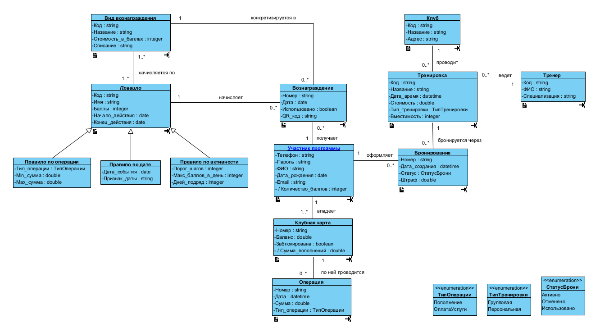

---

# ЧАСТЬ Б. Проверка модели через OCL (MDriven Designer)

## 3.1. Перенос модели

Модель классов перенесена из Visual Paradigm в MDriven Designer вручную и сохранена как `fitness.modlr`. Для OCL-проверки перенесено **ядро лояльности** (6 классов: Участник программы, Клубная карта, Операция, Вознаграждение, Вид вознаграждения, Правило) - именно на нём строятся навигационные запросы. У каждой ассоциации заданы **имена концов (ролей)** - по ним выполняется навигация в OCL.

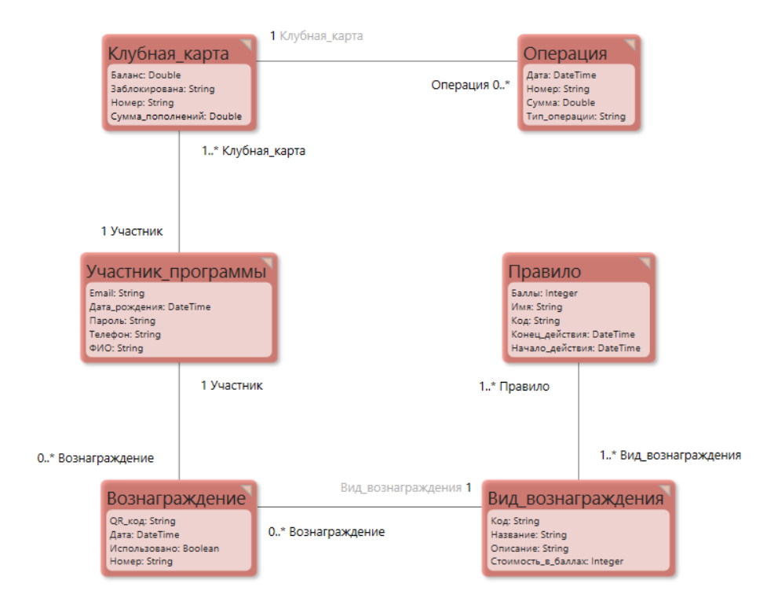

## 3.2. Мини-ликбез по OCL

| Запись | Что делает |
|---|---|
| `Класс.allInstances` | все объекты класса |
| `.атрибут` / `.Роль` | навигация по атрибуту или связи |
| `->select(x \| условие)` | отобрать объекты по условию |
| `->collect(x \| выражение)` | вычислить выражение для каждого |
| `->sum` / `->size` | сумма / количество |
| `.asString` | привести к строке |
| `self` | текущий объект (в ограничениях и derived) |

**Главное правило:** `.` (точка) - шаг по модели (атрибут/роль); `->` (стрелка) - операция над коллекцией.

## 3.3. Ограничения (инварианты)

| Класс | OCL-ограничение | Смысл |
|---|---|---|
| Клубная карта | `self.Баланс >= 0` | баланс не может быть отрицательным |
| Правило | `self.Конец_действия > self.Начало_действия` | период действия корректен |
| Вид вознаграждения | `self.Стоимость_в_баллах > 0` | вознаграждение стоит больше нуля баллов |

Все три приняты валидатором (зелёный индикатор, Returns = Boolean).

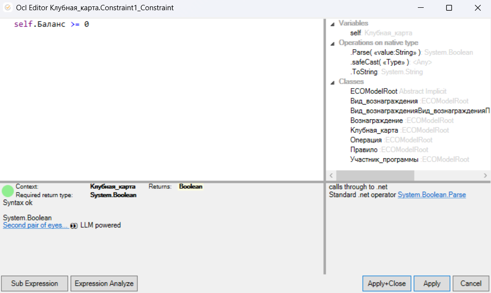
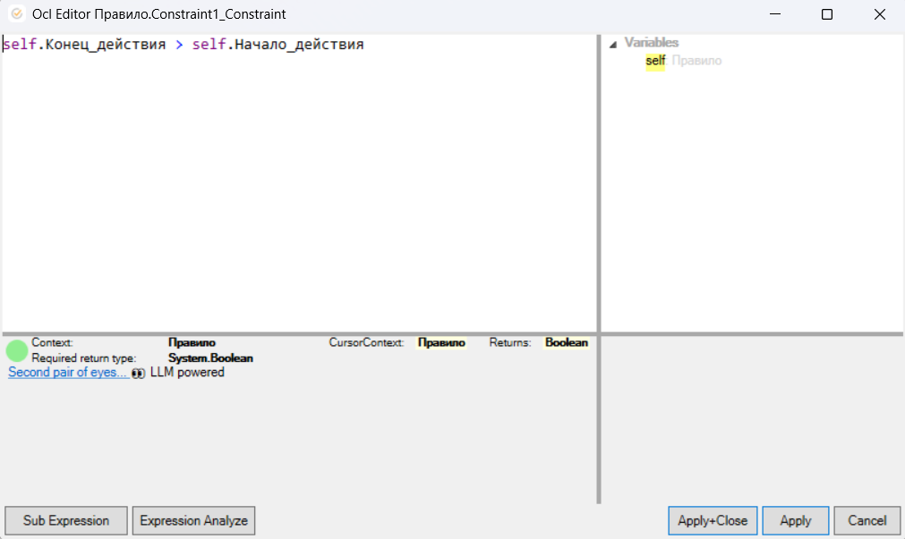
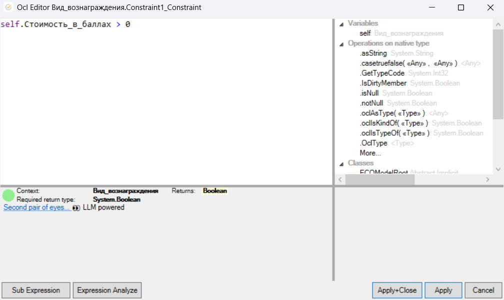

## 3.4. Вычисляемый атрибут (DerivationOCL)

Для derived-атрибута `Клубная_карта.Сумма_пополнений` задана формула (в контексте карты `self`):
```
self.Операция->select(o | o.Тип_операции = 'Пополнение').Сумма->sum
```
Тип результата - Double, валидатор зелёный.

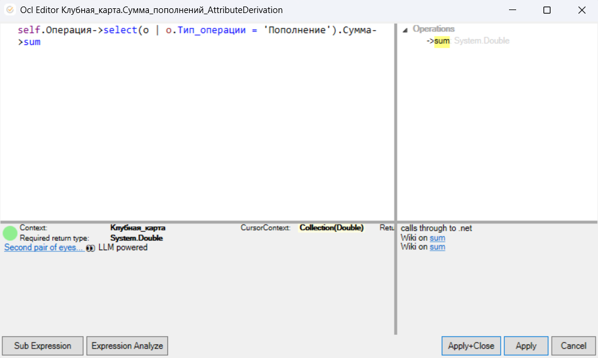

## 3.5. Навигационные запросы

Качество модели проверяется прикладными вопросами: если на вопрос заказчика можно ответить одним OCL-выражением без ошибок, модель поддерживает нужную навигацию. Все запросы выполнены в OCL Evaluator (режим Prototype → Debugger), вкладка Error чистая.

**1. Все участники программы** *(проверка доступа к классу)*
```
Участник_программы.allInstances
```
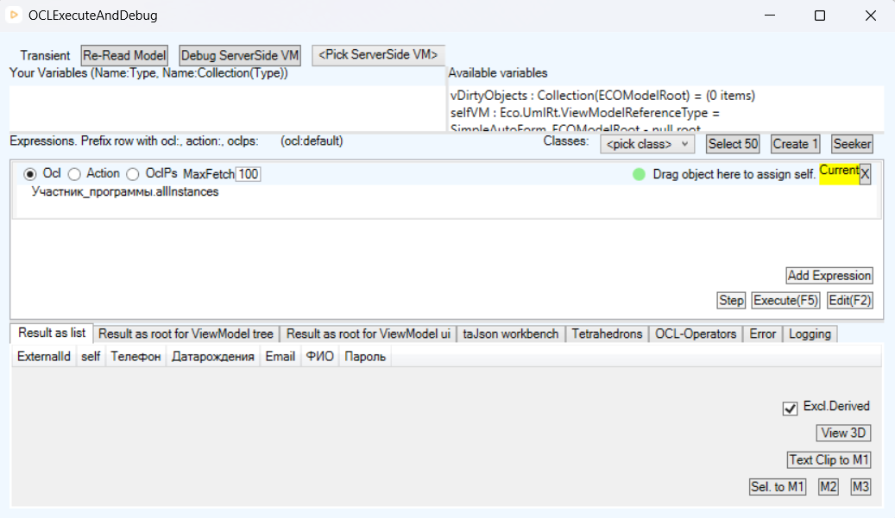

**2. На какую сумму пополнил баланс каждый участник**
```
Участник_программы.allInstances->collect(p | 'Пополнено: ' +
  p.Клубная_карта.Операция->select(o | o.Тип_операции = 'Пополнение').Сумма->sum.asString +
  ' (' + p.ФИО + ')')
```
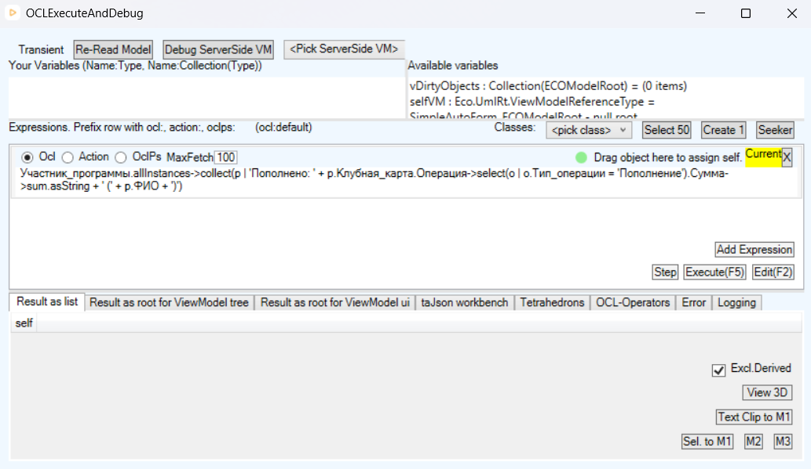

**3. По каким правилам даётся вознаграждение «Бонусная тренировка»**
```
Вид_вознаграждения.allInstances->select(v | v.Название = 'Бонусная тренировка').Правило.Имя
```
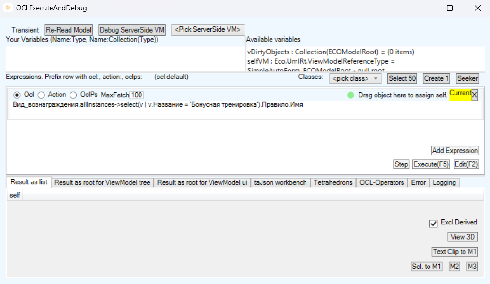

**4. Сумма оплат услуг каждого участника**
```
Участник_программы.allInstances->collect(p | p.ФИО + ': ' +
  p.Клубная_карта.Операция->select(o | o.Тип_операции = 'ОплатаУслуги').Сумма->sum.asString)
```
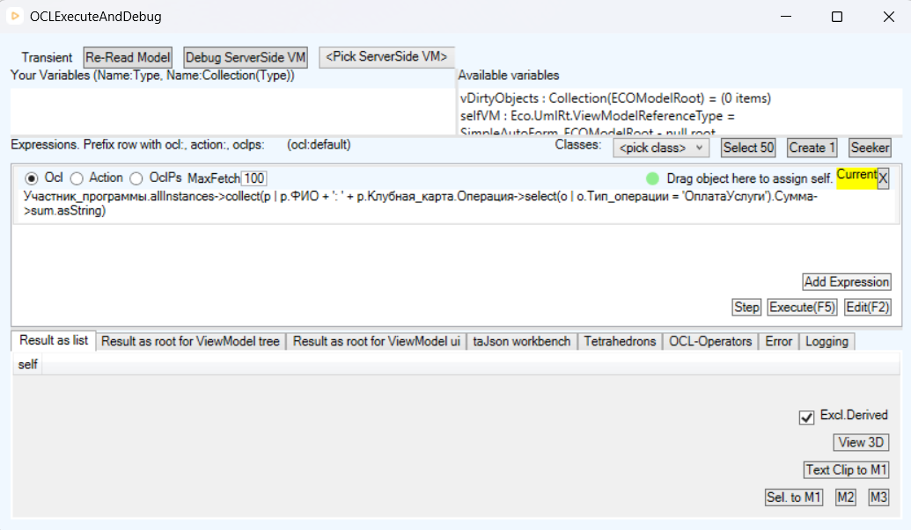

**5. Сколько вознаграждений у каждого участника**
```
Участник_программы.allInstances->collect(p | p.ФИО + ': ' +
  p.Вознаграждение->size.asString + ' вознаграждений')
```
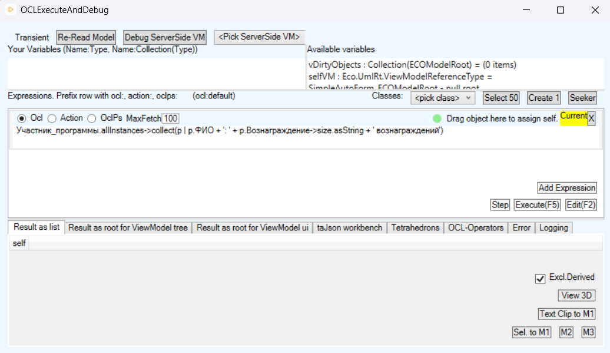

**6. Сумма пополнений по каждой карте** *(проверка формулы derived-атрибута)*
```
Клубная_карта.allInstances->collect(k | k.Номер + ': ' +
  k.Операция->select(o | o.Тип_операции = 'Пополнение').Сумма->sum.asString)
```
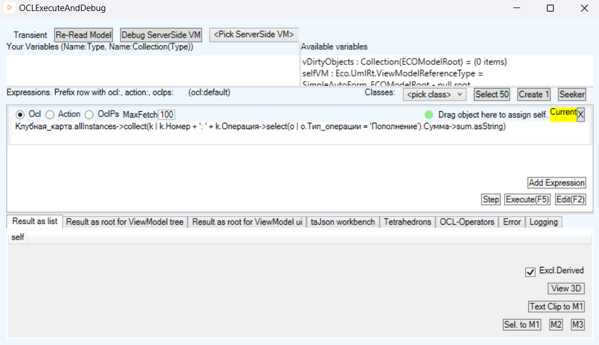

> Запросы выполнялись на модели без тестовых данных (persistence = None), поэтому результат пуст, но все выражения синтаксически корректны и типобезопасны - это доказывает, что модель поддерживает требуемую навигацию.

---

## 4. Соответствие чек-листу

| Критерий | Где в работе | Статус |
|---|---|---|
| 2.8 Нет классов без атрибутов/связей | §2.1 | ✅ |
| 2.9 Атрибуты распределены по классам | §2.1 | ✅ |
| 2.11 Использованы перечисления | §2.2 | ✅ |
| Обобщение/специализация | §2.3 | ✅ |
| 2.7 Модель выполнена в MDriven Designer | §3.1 | ✅ |
| 2.13 OCL-навигация (запросы) | §3.5 | ✅ |
| 2.14 OCL-ограничения (инварианты) | §3.3 | ✅ |